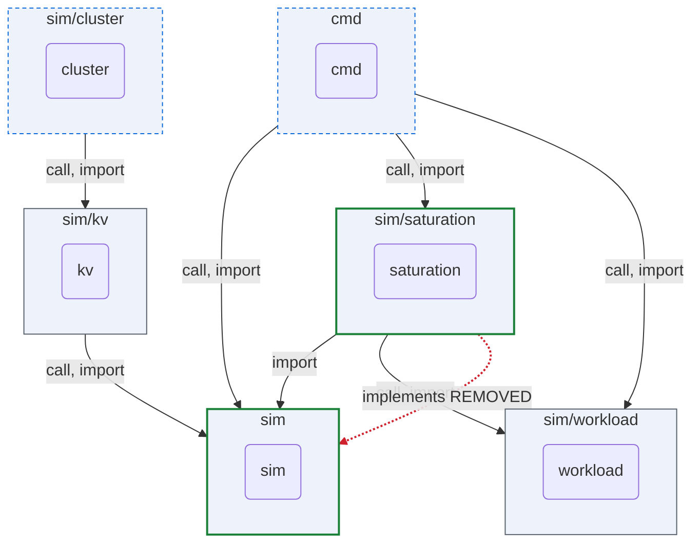
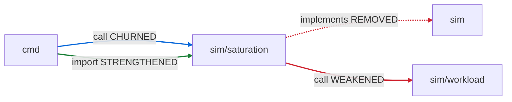
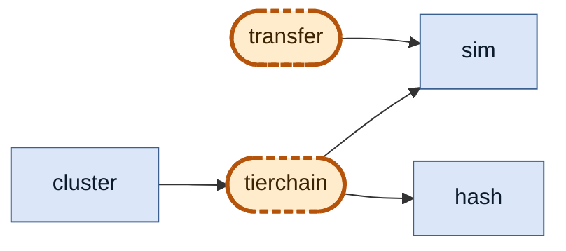

# ARCHON

ARCHON reads a Go codebase and shows you its architecture: which packages depend
on which, which interfaces are implemented, what a pull request changed at the
boundary level, and whether the contract tests actually cover those boundaries.
It is fully deterministic — same input, same output, byte for byte — and uses no
LLM. It treats software architecture as a checked, versioned contract for code
review and agentic software evolution.

## Quick start

```sh
git clone https://github.com/AI-native-Systems-Research/archon.git
cd archon
go build -o archon-go .

R=/path/to/your/repo
./archon-go health $R                                   # is it healthy?
./archon-go render $R --full --format=dot | dot -Tpng -o arch.png   # draw it
./archon-go delta  $R HEAD~1 HEAD --summary             # what did the last commit change?
./archon-go pr-review $R <base> <head> --out .archon    # CI review bundle (review.md + json)
```

---

## How Archon works — two flows

### Flow 1: PR Review (existing code, no setup)

You have a Go repo. A PR comes in. Archon tells you what changed **architecturally** — not every line, just the boundary-level picture.

**Input:** two commits (base and head)

```sh
archon-go pr-review . 70e9ba85 d77764f5 --out .archon
```

**Output:** `.archon/review.md` — real output from running archon on [BLIS PR #1546](https://github.com/inference-sim/inference-sim/pull/1546):

```
## ARCHON PR review — 70e9ba85 → d77764f5

Verdict: ARCHITECTURAL_CHANGE
Architectural change — a package boundary moved; an architecture review is required.

1 edge− · 2 surface · 1 schema · 4 invariant · 1 contract
```

Component view (real Mermaid from the run — renders in GitHub):



_Green border = boundary moved. Blue dashed = surface/invariant touched. Grey = unchanged. Red dashed arrow = edge removed._

Witness delta (real output — which connections strengthened, weakened, or broke):



| Edge | Kind | Status | Detail |
|---|---|---|---|
| `sim/saturation → sim` | implements | **REMOVED** | `Bank \|= BatchClassifier` fully decoupled |
| `sim/saturation → sim/workload` | call | **WEAKENED** | `NewBacklogClassifier` removed, still coupled via `DefaultBacklogDriftConfig` |

**What it answers:**
- Did any package boundary move? (or is this a safe internal-only change?)
- Which interfaces gained/lost implementers?
- Which dependencies were added or removed?
- Are there any cycles or layering violations?

**Other useful commands:**
```sh
archon-go health $R                    # cycles, god-modules, blast radius
archon-go impact $R .../sim/kv         # what depends on this package?
archon-go reflexion $R layers.json     # does code match declared layering?
archon-go evidence $R                  # are interface contracts test-covered?
```

---

### Flow 2: Design Phase → PR Review (declare intent before coding)

You're about to build a new feature. You declare what packages should exist,
what they should export, and what they're allowed to import — **before writing
code**. Archon then gates every PR: "did this move us closer to the plan?"

#### Step 1: Write a `.archon` plan

Example from [BLIS inference-sim#1585](https://github.com/inference-sim/inference-sim/issues/1585) —
redesigning the KV-cache offload subsystem:

```
# kv-offload.archon — declare the intended architecture

invariant determinism {
  statement: same seed produces byte-identical output
  evidence: property_test
}

invariant conservation {
  statement: allocated + free = total at all times
  evidence: property_test
}

# Existing packages (already implemented)
box github.com/inference-sim/sim
box github.com/inference-sim/sim/internal/hash
box github.com/inference-sim/sim/cluster

# New packages to build
hole github.com/inference-sim/sim/kv/tierchain {
  surface:
    Lookup(BlockKey, ReqCtx) LookupResult
    PrepareStore(keys, ReqCtx) StoreGrant
    CompleteStore(keys, ok bool)
    TierCount() int
  allow:
    import github.com/inference-sim/sim
    import github.com/inference-sim/sim/internal/hash
  contract:
    BC-C1 only tier 0 exchanges blocks with GPU    [evidenced: differential_test]
    BC-C2 allocated + free = capacity, always      [evidenced: property_test]
    BC-C4 a block with ref_cnt != 0 is never evicted [evidenced: property_test]
  cites:
    invariant determinism
    invariant conservation
}

hole github.com/inference-sim/sim/kv/transfer {
  surface:
    Submit(TransferJob) JobId
    Poll(now int64) []JobId
    ActiveJobs(TierIndex, Direction) int
  allow:
    import github.com/inference-sim/sim
  contract:
    BC-S1 at most n_read + n_write jobs in service   [evidenced: property_test]
    BC-S2 read-priority servers take reads first     [evidenced: metamorphic_test]
  cites:
    invariant determinism
}

# Declared dependencies
arrow github.com/inference-sim/sim/cluster -> github.com/inference-sim/sim/kv/tierchain : import
arrow github.com/inference-sim/sim/kv/tierchain -> github.com/inference-sim/sim : import
arrow github.com/inference-sim/sim/kv/tierchain -> github.com/inference-sim/sim/internal/hash : import
arrow github.com/inference-sim/sim/kv/transfer -> github.com/inference-sim/sim : import
```

#### Step 2: Compile and commit

```sh
archon-go plan compile --stats kv-offload.archon > kv-offload.plan.json
```

Stats output (stderr):
```
5 clauses: 0 checked, 5 evidenced, 0 attested:external, 0 attested:design
```

The compiled JSON is standard graph format (same as `extract` output):
```json
{
  "packages": [
    {"path": ".../sim/kv/tierchain", "hole": true, "surface": [...]},
    {"path": ".../sim/kv/transfer", "hole": true, "surface": [...]},
    {"path": ".../sim", "internal": true},
    ...
  ],
  "edges": [...]
}
```

Visualize the plan as a Mermaid diagram:
```sh
archon-go plan render kv-offload.plan.json
```



_Holes (tierchain, transfer) are stadium-shaped with dashed borders. Existing boxes are solid._

Commit `kv-offload.plan.json` to your repo.

#### Step 3: Check distance (how far is the code from the plan?)

```sh
archon-go plan dist kv-offload.plan.json .
```

Output before any implementation:
```
dist(P,G) = 7
  unfilled holes (C1): 2
  absent boxes   (C2): 0
  absent arrows  (C3): 4
  disallowed     (C4): 0

  [C1] hole declared, package absent in actual
  [C1] hole declared, package absent in actual
  [C3] declared arrow .../cluster -> .../kv/tierchain (import) absent
  [C3] declared arrow .../kv/tierchain -> .../sim (import) absent
  ...
```

#### Step 4: PR review with plan gate

After implementing part of the feature, open a PR:

```sh
archon-go pr-review . main feat/add-tierchain --plan kv-offload.plan.json --out .archon
```

Output in `.archon/review.md`:
```
Verdict: ARCHITECTURAL_CHANGE

G5 — Plan distance ratchet
  dist(P,G): 7 → 4 — OK

Plan verdict: REALIZES — discharges plan obligations without introducing new ones

  1 pkg+, 2 edge+

Component view:
  [mermaid diagram]
```

**dist went from 7 to 4, verdict is REALIZES — the PR filled a hole. OK.**

If a later PR introduces a dependency that the plan forbids:
```
G5 — Plan distance ratchet
  dist(P,G): 4 → 5 — REGRESSION

Plan verdict: CONFLICTS — introduced a dependency outside a declared Allow list

G3 — Surface growth on fixed packages
  sim/kv/tierchain +1 entities: UnauthorizedFunc
```

**dist went up — the PR moved us away from the plan. REGRESSION.**

---

## The plan syntax

Four block types — see [docs/plan-syntax.md](docs/plan-syntax.md) for the full reference:

| Block | What it declares |
|-------|-----------------|
| `hole <path> { ... }` | A package that should exist but doesn't yet |
| `box <path>` | An existing package the plan depends on |
| `arrow <from> -> <to> : <kind>` | A dependency that must exist |
| `invariant <name> { ... }` | A cross-cutting property, declared once |

---

## What `dist` counts

| Class | Meaning |
|-------|---------|
| C1 | Unfilled hole — declared but not implemented |
| C2 | Absent box — declared existing package is missing |
| C3 | Absent arrow — declared dependency is missing |
| C4 | Disallowed arrow — dependency exists but plan forbids it |

`dist = 0` means the code fully realizes the plan.

---

## Plan verdicts

When `--plan` is used, archon classifies the PR's relationship to the plan:

| Verdict | Meaning | Precedence |
|---------|---------|-----------|
| **REALIZES** | PR fills a hole or adds a declared arrow — progress | 3 (good) |
| **EXCEEDS** | PR adds structure the plan doesn't mention — real work, outside plan | 2 |
| **CONFLICTS** | PR adds a disallowed arrow or moves away from the plan | 1 (worst) |
| **UNRELATED** | PR touches nothing the plan mentions | 4 |

Precedence: worst wins. A PR that fills a hole AND adds a disallowed arrow is **CONFLICTS**.

---

## Plan utilities

Beyond compile and dist, three utilities help you work with plans:

```sh
# Extract one hole as a work order (share with a teammate or sub-issue)
archon-go plan slice kv-offload.plan.json github.com/inference-sim/sim/kv/tierchain
```

Output:
```markdown
# github.com/inference-sim/sim/kv/tierchain

## Surface
- `CompleteStore(keys, ok bool)`
- `Lookup(BlockKey, ReqCtx) LookupResult`
- `PrepareStore(keys, ReqCtx) StoreGrant`
- `TierCount() int`

## Allow
- `import github.com/inference-sim/sim`
- `import github.com/inference-sim/sim/internal/hash`

## Contract
- **BC-C1**
- **BC-C2**
- **BC-C4**
```

```sh
# Render plan as Mermaid (paste into GitHub issues/PRs)
archon-go plan render kv-offload.plan.json

# Compile with clause tally
archon-go plan compile --stats kv-offload.archon > plan.json
# stderr: 5 clauses: 0 checked, 5 evidenced, 0 attested:external, 0 attested:design
```

---

## Repository layout

- **`main.go`** — the `archon-go` CLI (subcommands: `extract`, `delta`, `render`,
  `contract`, `evidence`, `impact`, `health`, `reflexion`, `pr-review`, `plan`).
- **`internal/`** — the analysis libraries (`extract`, `graph`, `delta`,
  `evidence`, `impact`, `health`, `reflexion`, `render`, `plan`, `gate`).
- **`cmd/`** — auxiliary CLI tools (`consumes`, `callgraph`, `eventflow`), each
  built separately, e.g. `go build -o consumes ./cmd/consumes`.
- **`reviewer/`** — deterministic, no-LLM Python views for PR review
  (`review.py` wrapper + the per-view scripts) and a worked example under
  `reviewer/examples/`.
- **`scripts/`** — helper scripts.
- **`fixtures/`** — test fixtures.
- **`results/`** — the evaluation harness and experiment artifacts.
- **`docs/`** — prose: the paper (`docs/paper`), related work
  (`docs/related-work`), design notes (`docs/notes`), and write-ups.

The full command walkthrough — every command, with example output — is in
[`USERGUIDE.md`](USERGUIDE.md). For declaring an intended architecture before code
exists, see the [**plan syntax reference**](docs/plan-syntax.md). For a PR review
at three altitudes in one command, see the reviewer wrapper:
[`reviewer/review.py`](reviewer/review.py) and
[`reviewer/RENDERERS.md`](reviewer/RENDERERS.md).

## Framing

ARCHON is intended for both greenfield and brownfield repositories. In greenfield
projects, the intended architecture graph can be written alongside the initial
implementation. In brownfield projects, ARCHON starts by snapshotting the actual
graph, then uses reviewed graph deltas and ratcheting policies to make
architecture visible and incrementally repair it.
