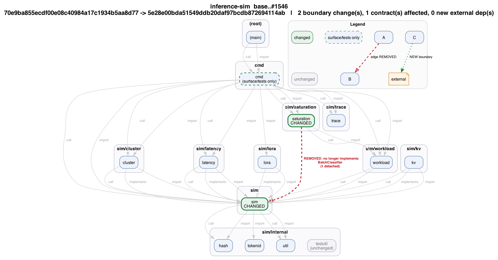
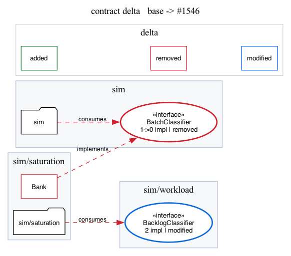
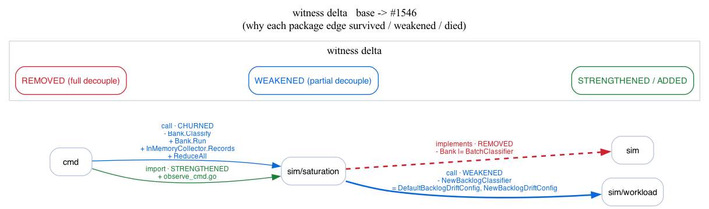
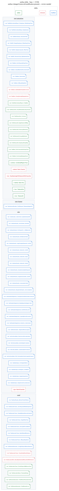

# ARCHON rendering — what draws the graphs, and what CI should call

ARCHON has two layers of rendering: the **built-in renderer** inside the Go
binary, and the **reviewer renderers** (the Python scripts that produce the PR
pictures). Everything here is deterministic and uses no LLM — the same repo and
commits always produce the same bytes.

---

## 1. The built-in renderer (in the Go binary)

ARCHON already has functions called `DOT()`, `Mermaid()`, `DOTDiff()`, and
`MermaidDiff()`. `DOT`/`Mermaid` draw one commit's architecture; `DOTDiff`/
`MermaidDiff` compare two commits and draw the *changed* architecture. There is
also `focusChanged()`, which removes unrelated parts of the repo so the PR
diagram only shows the changed neighborhood.

Very simply:

- **`Mermaid()`** = draw the architecture at one commit
- **`MermaidDiff()`** = draw what changed between commit A and B
- **`DOT()` / `DOTDiff()`** = the same information, just in another graph format
- **`focusChanged()`** = hide unrelated things so the PR graph isn't huge

These are reached from the CLI through `render`:

```sh
R=/path/to/your/repo

# one commit, whole architecture (Mermaid pastes straight into a PR comment)
./archon-go render $R --full --format=mermaid

# what a PR changed (only the changed neighborhood — focusChanged is applied
# automatically when you don't pass --full)
./archon-go render $R <base> <head> --format=mermaid

# same, as a Graphviz picture
./archon-go render $R <base> <head> --format=dot | dot -Tpng -o delta.png
```

---

## 2. The reviewer renderers

These are the higher-altitude views. Each reads JSON that ARCHON already
produced and renders it — they add no new analysis.

- **`component_view.py`** = show the project as higher-level components/packages
- **`component_delta.py`** = show which components/boundaries this PR changed
- **`contract_view.py`** = show interfaces, who implements them, and where they're used
- **`contract_delta.py`** = show which of those interface relationships changed in the PR
- **`witness_delta.py`** = show the exact reasons a connection disappeared or still exists
- **`surface_delta.py`** = show detailed public API, schema, and invariant/test changes
- **`review.py`** = a wrapper that runs these views for you using `--level 1/2/3`
  instead of manually invoking each script

---

## 3. Worked example — BLIS PR #1546

PR #1546's goal was to **decouple `sim/saturation`** from `sim` and from
`sim/workload`. Below is what each renderer showed, and the exact command that
produced the image. All of these images are committed under
[`examples/pr1546/`](examples/pr1546/).

The two commits used throughout are the PR's merge-base and head:

```sh
R=/path/to/inference-sim
BASE=70e9ba8      # merge-base
HEAD=5e28e00b     # PR head
```

The fastest way to reproduce **all** of the images below is the wrapper — one
call per level writes the figures into an output folder:

```sh
python3 reviewer/review.py $R $BASE $HEAD --level 1 --label-a base --label-b "#1546"
python3 reviewer/review.py $R $BASE $HEAD --level 2 --label-a base --label-b "#1546"
python3 reviewer/review.py $R $BASE $HEAD --level 3 --label-a base --label-b "#1546"
```

Each section also gives the single-script command, in case you want just one view.

### 3.1 `component_delta.py` — where the change is concentrated

> `sim/saturation` and `sim` are where the architectural change is concentrated.



```sh
# inputs
./archon-go extract $R $HEAD > B.extract.json
./archon-go delta   $R $BASE $HEAD --json > delta.json
# derive the component boxes (by directory) and paint the PR on them
python3 reviewer/component_view.py  B.extract.json --emit-components > components.json
python3 reviewer/component_delta.py delta.json components.json "inference-sim base..#1546" \
    --graph B.extract.json | dot -Tpng -o level2_component_delta.png
```

(The plain component map — the system as boxes, before any PR is painted on —
is [`level2_components.png`](examples/pr1546/level2_components.png), from
`component_view.py B.extract.json --format dot`. A Mermaid version that renders
inline in a PR comment is [`level2_components.mmd`](examples/pr1546/level2_components.mmd).)

### 3.2 `contract_delta.py` — which interface relationship changed

> `Bank → implements → BatchClassifier` disappeared.



```sh
# consumes is working-tree based, so snapshot each commit (checkout, run, restore)
go build -o consumes ./cmd/consumes
git -C $R checkout $BASE && ./consumes $R ./... --json > A.consumes.json
git -C $R checkout $HEAD && ./consumes $R ./... --json > B.consumes.json
git -C $R checkout -                       # restore your branch
python3 reviewer/contract_delta.py A.consumes.json B.consumes.json \
    --interface BatchClassifier --format dot | dot -Tpng -o level3_contract_delta.png
```

### 3.3 `witness_delta.py` — the exact reasons a connection died or survived

> `NewBacklogClassifier` disappeared from the `saturation → workload` connection,
> but `DefaultBacklogDriftConfig` and `NewBacklogDriftConfig` remain — so the edge
> is only **partially** decoupled, while `saturation → sim` is **fully** decoupled.



```sh
./archon-go extract $R $BASE > A.extract.json
./archon-go extract $R $HEAD > B.extract.json
python3 reviewer/witness_delta.py A.extract.json B.extract.json \
    --label-a base --label-b "#1546" --format dot | dot -Tpng -o level3_witness.png
```

### 3.4 `surface_delta.py` — the API/schema/invariant changes underneath

> The functions, types, schema fields, and tests/invariants that moved under all
> of the above.



```sh
./archon-go delta $R $BASE $HEAD --json > delta.json
python3 reviewer/surface_delta.py delta.json --label-a base --label-b "#1546" \
    --format dot | dot -Tpng -o level1_surface.png
```

---

## 4. A short CLI cheat-sheet

```sh
R=/path/to/your/repo

# quick triage — one line: fast-track, or needs an architecture review?
./archon-go delta $R <base> <head> --summary

# the whole reviewer bundle for a PR, one call per altitude:
python3 reviewer/review.py $R <base> <head> --level 1     # SUMMARY   (surface)
python3 reviewer/review.py $R <base> <head> --level 2     # STRUCTURE (components)
python3 reviewer/review.py $R <base> <head> --level 3     # CONTRACTS (witness + contract)

# handy review.py flags:
#   --reuse           re-render from JSON already produced (no repo touched)
#   --skip-contract   level 3 without the consumes checkout
#   --from/--to PKG   focus the witness view on one dependency
#   --interface NAME  focus the contract view on one interface
#   --outdir DIR      where the text + PNGs go
```

---

## 5. What CI should call

**CI should call `archon-go pr-review`** — the single Go subcommand that bundles
the whole story. It needs nothing but the one binary (no Python) and no
working-tree checkout: each commit is read through an ephemeral git worktree, and
the interface-contract delta is derived from the delta itself, not from
`consumes`.

```yaml
# in a GitHub Action step (the CI glue itself is the mentor's job):
- run: |
    ./archon-go pr-review "$REPO" "$BASE" "$HEAD" --out .archon --allow allow.json
    cat .archon/review.md >> "$GITHUB_STEP_SUMMARY"   # Mermaid renders inline
- uses: actions/upload-artifact@v4
  with: { name: archon-review, path: .archon/ }
```

`pr-review` writes a **bundle** (`review.md` + `review.json` + `component`/
`witness` graphs + `contract.md`) and is **report-only**: it always exits 0, and
the tiered verdict — `FAST_TRACK` / `REVIEW_INVARIANTS` / `REVIEW_ARCHITECTURE` /
`BLOCK` — is carried in `review.json` for the CI to act on (e.g. fail the check on
`"verdict":"BLOCK"`). `review.md` is written for `>> $GITHUB_STEP_SUMMARY` or a PR
comment: it leads with the verdict and, only when the change is architectural,
embeds the component **Mermaid** (renders inline on GitHub) plus the
witness/contract/violation **tables**. The `.png` files are for
`upload-artifact` (GitHub does not render local PNGs inline). See the full
walkthrough of the command and its flags in
[`USERGUIDE.md`](../USERGUIDE.md) (§4, `pr-review`).

`pr-review` is the faithful Go port of the level-3 chain below; the
`reviewer/review.py --level N` **wrapper remains the interactive, human path**
(three altitudes, per-view PNGs, `--reuse`/`--from`/`--interface` focus flags).
Use the wrapper when exploring a PR by hand; use `pr-review` in CI.
