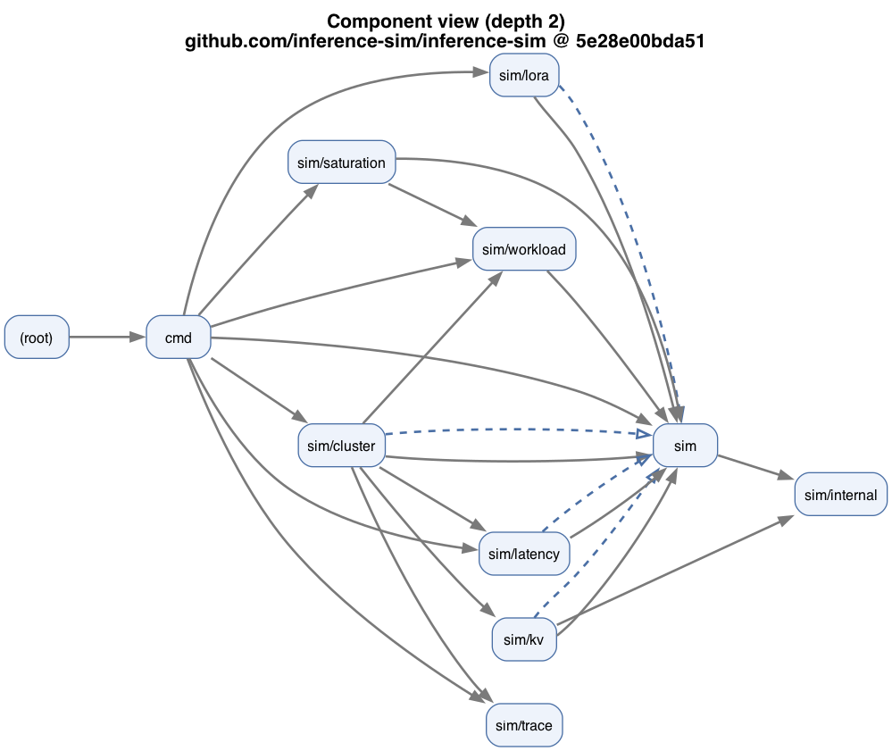

# Reviewer views — worked example: inference-sim PR #1546

Every file here was produced by one command, with **no LLM and no hand-editing**:

```sh
R=/path/to/inference-sim
python3 reviewer/review.py $R 70e9ba8 5e28e00b --level 1 --label-a base --label-b "#1546"
python3 reviewer/review.py $R 70e9ba8 5e28e00b --level 2 --label-a base --label-b "#1546"
python3 reviewer/review.py $R 70e9ba8 5e28e00b --level 3 --label-a base --label-b "#1546"
```

(`70e9ba8` = the PR's merge-base, `5e28e00b` = the PR head.) Re-running on the
same commits reproduces these bytes exactly.

PR #1546's stated goal was to **decouple `sim/saturation`** from `sim` and from
`sim/workload`. The three levels answer, in escalating detail, *what changed* →
*where it landed* → *whether the decoupling actually happened*.

## Level 1 — Surface delta · "what changed"


Packages / exported symbols / struct schemas / edges / invariants added
(green), removed (red), modified (blue). Text: [`level1_surface.txt`](level1_surface.txt).
The triage line at the top says whether a human needs to look. Fastest read for a
reviewer.

## Level 2 — Component map + delta · "where it landed"



The system as **auto-derived** component boxes (grouped by directory — no
hand-written grouping), then the PR painted on top: the removed
`saturation ⊨ sim` contract edge is the red dashed arrow, and the two packages
the PR touched (`sim`, `sim/saturation`) are green. Mermaid source of the map:
[`level2_components.mmd`](level2_components.mmd).

## Level 3 — Witness delta + contract delta · "did the decoupling happen"


This is the level that answers the author's actual question. Per package edge, it
diffs the concrete **witnesses** ARCHON records (the symbols/types/files that make
the edge exist) and classifies each:

- `sim/saturation ⊨ sim` — **REMOVED** (full decouple): `Bank` no longer
  implements `BatchClassifier`, edge and its only reason both gone.
- `sim/saturation → sim/workload` — **WEAKENED** (*partial* decouple): the
  interface call `NewBacklogClassifier` was cut, but two config calls
  (`DefaultBacklogDriftConfig`, `NewBacklogDriftConfig`) still cross the boundary,
  so the edge survives.

So: one decoupling landed fully, the other only partially — a distinction the
package/component graph (edge present/absent) cannot show. Text:
[`level3_witness.txt`](level3_witness.txt).


The interface-contract delta confirms it from the other side: `sim.BatchClassifier`
flipped from **STRANDED** (a single cross-package implementer used only in its own
package) to **removed** — the PR cleared the smell. Text:
[`level3_contract.txt`](level3_contract.txt).
